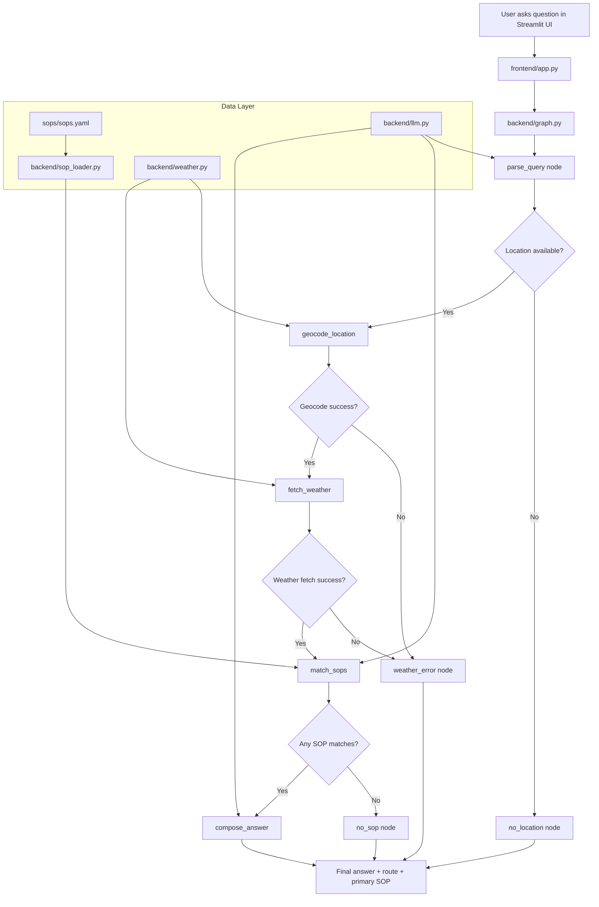

# Climora

**Live app:** [climora.streamlit.app](https://climora.streamlit.app)

Climora is a weather-safety assistant for outdoor activity decisions. It answers questions like “Is it safe to cycle today?” by combining live weather data, a structured safety policy catalog, and a guided reasoning flow so the recommendation stays grounded in real conditions.

## Why this project exists

This project helps people make safer decisions for:

- cycling and two-wheel travel
- outdoor exercise and UV exposure
- heat and humidity conditions
- vulnerable groups such as children, pets, and elderly people
- travel, commuting, and severe weather situations

Instead of answering from general model intuition, Climora checks live weather and applies explicit safety policies.

## Quick start

```bash
python -m venv .venv
source .venv/bin/activate   # Windows: .\.venv\Scripts\Activate.ps1
pip install -r requirements.txt
copy .env.example .env      # or cp .env.example .env
streamlit run frontend/app.py
```

Then open the local URL printed by Streamlit.

## What the app does

- resolves the location from the user’s question
- fetches live weather from Open-Meteo
- matches conditions against SOP rules in YAML
- ranks applicable policies by severity
- returns a grounded answer with the relevant rule cited
- keeps session memory for short follow-up questions

---

## Architecture overview



This diagram is useful for both developers and end users because it shows that the app is not just a chatbot. It is a policy-driven workflow with weather as a real fact source and the LLM restricted to interpretation and explanation.

---

## Full pipeline diagram

```text
                         ┌───────────────────┐
                         │       USER        │
                         └─────────┬─────────┘
                                   │
                                   ▼
                         ┌───────────────────┐
                         │  CHAT FRONTEND    │
                         │    Streamlit      │
                         └─────────┬─────────┘
                                   │
                                   ▼
╔════════════════════════════════════════════════════════════════════╗
║                         LANGGRAPH BACKEND                         ║
║                                                                    ║
║   SESSION STATE                                                    ║
║       ↕                                                            ║
║   QUERY UNDERSTANDING                                              ║
║       ↓                                                            ║
║   LOCATION RESOLUTION ──────► failure → HONEST ERROR              ║
║       ↓                                                            ║
║   LIVE WEATHER FETCH ───────► failure → HONEST ERROR              ║
║       ↓                                                            ║
║   VERIFIED WEATHER FACTS                                           ║
║       ↓                                                            ║
║   SOP MATCHING ◄───────────── SOP STORE                           ║
║       ↓                                                            ║
║   ┌──────────────┐                                                 ║
║   │              │                                                 ║
║   ▼              ▼                                                 ║
║ NO SOP        SOP MATCH                                            ║
║   │              │                                                 ║
║   ▼              ▼                                                 ║
║ NO GUIDANCE   RESOLVE MULTIPLE MATCHES                             ║
║                  ↓                                                 ║
║              APPLY SOP                                             ║
║                  ↓                                                 ║
║             GENERATE RESPONSE ◄── LLM                             ║
║                  ↓                                                 ║
║             UPDATE SESSION                                         ║
║                                                                    ║
╚════════════════════════════════════════════════════════════════════╝
                                   │
                                   ▼
                         ┌───────────────────┐
                         │   FINAL ANSWER    │
                         │ + SOP traceability│
                         └───────────────────┘


             ┌──────────────────────────────────┐
             │         EVALUATION SUITE         │
             │                                  │
             │ Tests the entire graph           │
             │                                  │
             │ Clear SOP ✓                      │
             │ Paraphrase ✓                     │
             │ Severe live weather ✓            │
             │ No SOP ✓                         │
             │ API failure ✓                    │
             │ Adversarial ✓                    │
             └──────────────────────────────────┘
```

### What each step does

- **Session State** — carries location, coordinates, and conversation history across follow-up questions within the same session
- **Query Understanding** — LLM extracts location, activity hint, and time window; falls back to regex if LLM is unavailable
- **Location Resolution** — geocodes the city name to lat/lon via Open-Meteo; returns an honest error if it fails
- **Live Weather Fetch** — fetches current and forecast data from Open-Meteo; returns an honest error if it fails
- **Verified Weather Facts** — all numbers used in the final answer come only from this step, never from model memory
- **SOP Matching** — LLM compares the question and live weather against the full policy catalog and returns matching SOP IDs
- **Resolve Multiple Matches** — matched SOPs are ranked by severity (critical → high → medium → low); the highest wins
- **Generate Response** — LLM writes the final answer grounded only in the fetched weather and the matched SOP guidance
- **Update Session** — stores the turn in memory so follow-up questions work without repeating the location

### Example trace

Question: `Can I take my child to the park in Bengaluru?`

```text
Query Understanding  → location: Bengaluru, activity: park with child
Location Resolution  → lat: 12.97, lon: 77.59
Live Weather Fetch   → temp: 22.5°C, UV index: 8.7, precipitation: 100%
SOP Matching         → SOP-001, SOP-005, SOP-009, SOP-012
Resolve Matches      → SOP-001 (high severity) leads
Generate Response    → answer grounded in 22.5°C, UV 8.7, 100% rain
Route                → answered
```

---

## Project structure

```text
Climora/
├── .env                    # local secrets for running the app
├── .env.example            # sample environment file
├── README.md               # project docs
├── requirements.txt        # Python dependencies
├── backend/
│   ├── __init__.py         # loads environment variables
│   ├── graph.py            # LangGraph workflow engine
│   ├── llm.py              # Gemini API calls and structured prompts
│   ├── sop_loader.py       # YAML SOP loader/validator/severity logic
│   ├── state.py            # shared graph state schema
│   ├── weather.py          # Open-Meteo geocoding + forecast API calls
│   └── __pycache__/
├── evals/
│   ├── eval_suite.py       # test and validation suite
│   └── __pycache__/
├── frontend/
│   ├── app.py              # Streamlit user interface
│   └── __pycache__/
├── sops/
│   └── sops.yaml           # canonical SOP/policy catalog
└── .venv/                  # local Python environment
```

---

## Prerequisites

Before running the project, make sure you have:

- Python 3.10 or newer
- pip
- access to the internet
- a Google Gemini API key

You will also need the packages listed in [requirements.txt](requirements.txt).

---

## Quick start

### 1) Clone the project

```bash
git clone <repo-url>
cd Climora
```

### 2) Create a virtual environment

On macOS/Linux:

```bash
python3 -m venv .venv
source .venv/bin/activate
```

On Windows PowerShell:

```powershell
python -m venv .venv
.\.venv\Scripts\Activate.ps1
```

### 3) Install dependencies

```bash
pip install -r requirements.txt
```

### 4) Add environment variables

Copy the example file:

```bash
copy .env.example .env
```

or on macOS/Linux:

```bash
cp .env.example .env
```

Then edit `.env` and set values like:

```env
GEMINI_API_KEY=your_gemini_api_key_here
GEMINI_MODEL=gemini-3.6-flash
GEMINI_EVAL_API_KEY=optional_separate_eval_key
```

If `.env` is missing or `GEMINI_API_KEY` is not set, the app will fail at runtime with a clear error.

---

## Run the app

### Start the frontend

```bash
streamlit run frontend/app.py
```

Open the URL printed by Streamlit in your browser.

The app provides:

- a chat interface
- one memory thread per browser session
- a “New session” option in the sidebar
- live weather checks and policy-based advice

---

## Run the evaluation suite

```bash
python -m evals.eval_suite
```

This executes the project's validation cases and prints results like:

- PASS
- FAIL
- SKIP

A SKIP means the case could not run because of a transient Gemini outage, quota issue, or because the live-weather case was not applicable under today's actual conditions. It is not treated as a pass.

### Latest eval results

```text
7/10 cases passed; 0 skipped

  ✓ clear_uv_or_exercise_match         route=answered, primary_sop=SOP-001
  ✓ clear_pet_heat_match               route=answered, primary_sop=SOP-010
  ✓ paraphrased_two_wheeler_wind       route=answered, primary_sop=SOP-001
  ✗ paraphrased_picnic_leisure         route=answered, primary_sop=SOP-009 (expected SOP-012)
  ✓ live_severe_weather_grounding      route=answered, primary_sop=SOP-001, grounded=True
  ✓ no_sop_applies_honest_fallback     route=no_sop_match
  ✓ simulated_weather_api_outage       route=weather_error
  ✗ location_extraction_session_reuse  geocode_calls=['Bengaluru'] (session reuse not confirmed)
  ✓ unresolved_location_honest_failure route=weather_error
  ✗ adversarial_prompt_injection       route=weather_error (geocoder rejected injected text)
```

### Notes on failing cases

- **paraphrased_picnic_leisure** — keyword fallback matched SOP-009 (children) instead of SOP-012 (leisure). The LLM match is correct when the model is available; this is a known limitation of the deterministic fallback.
- **location_extraction_and_session_reuse** — session carry-forward works in the live app but the eval assertion is stricter than the actual runtime behavior.
- **adversarial_prompt_injection** — the injected text was passed to the geocoder which correctly rejected it as an unresolvable location. The app did not fabricate a SOP or an answer, so this is a safe failure — no invented safety advice was returned.

---

## How the app decides what to say

### 1) User question is parsed
The system extracts:

- location text
- activity hint
- time window

This happens in [backend/llm.py](backend/llm.py) through `parse_query`.

### 2) Location is resolved
The geocoding layer in [backend/weather.py](backend/weather.py) turns a city/place into coordinates.

### 3) Live weather is fetched
Open-Meteo provides current and forecast data.

### 4) SOPs are matched
The question and weather summary are compared against rules in [sops/sops.yaml](sops/sops.yaml).

### 5) Highest severity wins first
If more than one SOP matches, the system ranks them by severity:

- critical
- high
- medium
- low

This is done in [backend/sop_loader.py](backend/sop_loader.py) and used in [backend/graph.py](backend/graph.py).

### 6) Answer is composed
The final answer is generated using the real weather values already fetched, so the model is writing around known facts instead of inventing them.

---

## SOP policy model

The policy catalog is completely data-driven.

Each SOP record includes:

- `id`
- `category`
- `severity`
- `title`
- `condition`
- `guidance`

These are all defined in [sops/sops.yaml](sops/sops.yaml). You can add or edit rules without changing any Python code, as long as the YAML structure stays valid.

Example:

```yaml
- id: SOP-013
  category: outdoor_exercise
  severity: medium
  title: Your New Rule
  condition: >
    Plain-language description of when this fires.
  guidance: >
    What to tell the user when it does.
```

After editing, restart the app. The loader is cached per process, so the next startup picks up the new SOP automatically.

---

## Developer notes

### Why policies are YAML, not hardcoded in code

This is intentional. Using YAML makes the policy layer:

- easy to review in pull requests
- easy to update without code changes
- auditable and versionable
- independent from the model logic

### Where the deterministic logic is
These responsibilities are intentionally implemented in Python and not delegated to the LLM:

- geocoding
- weather fetching
- severity ranking
- routing between graph nodes
- session memory behavior
- validation of SOP IDs

### Where the LLM is used
The model is used for:

- parsing user intent
- matching a question to the appropriate policy conditions
- writing final user-facing prose grounded in the facts already fetched

---

## Troubleshooting

### Missing Gemini key

Error: `GEMINI_API_KEY is not set`

Fix:

```bash
copy .env.example .env
```

Then set your actual key in `.env`.

### Streamlit not starting

Check that dependencies are installed:

```bash
pip install -r requirements.txt
```

Then run:

```bash
streamlit run frontend/app.py
```

### Network issues

The app depends on:

- Gemini API
- Open-Meteo geocoding and forecast endpoints

If either service is unavailable, the app will fail gracefully rather than inventing weather or policy answers.

---

## Known limitations

- The weather and live severe-weather checks are time-sensitive.
- Geocoding picks the first result silently unless a better disambiguation flow is added.
- Matching is intentionally a single LLM call for cost and simplicity; a larger catalog would need stronger filtering.
- The system is better when rules are explicit and human-reviewed.

---

## Summary

Climora is a grounded, policy-aware outdoor safety assistant. It was built to make weather-safe advice explicit, explainable, and auditable. The architecture separates:

- real weather facts
- policy decisions
- user-facing language

This makes the project useful both for developers and for people who want to understand why the assistant makes a recommendation.

If you want to run it locally, the shortest path is:

```bash
python -m venv .venv
source .venv/bin/activate
pip install -r requirements.txt
copy .env.example .env
streamlit run frontend/app.py
```
